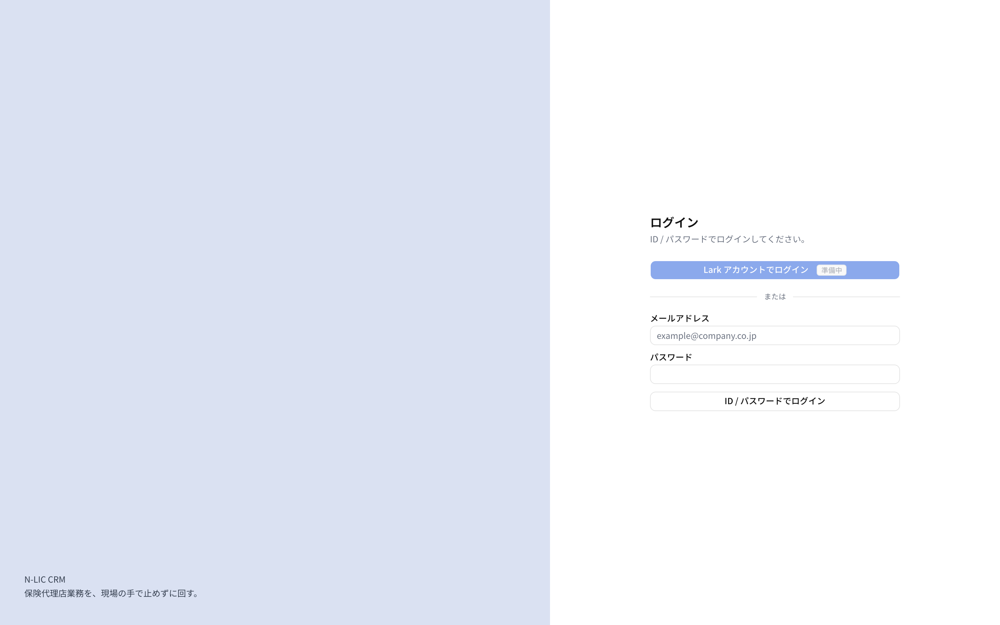
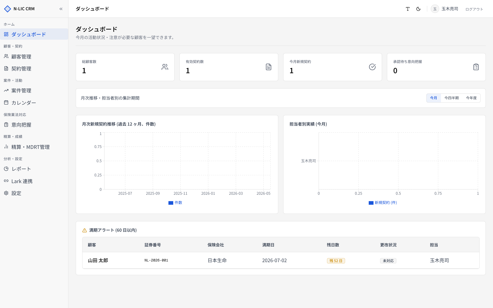
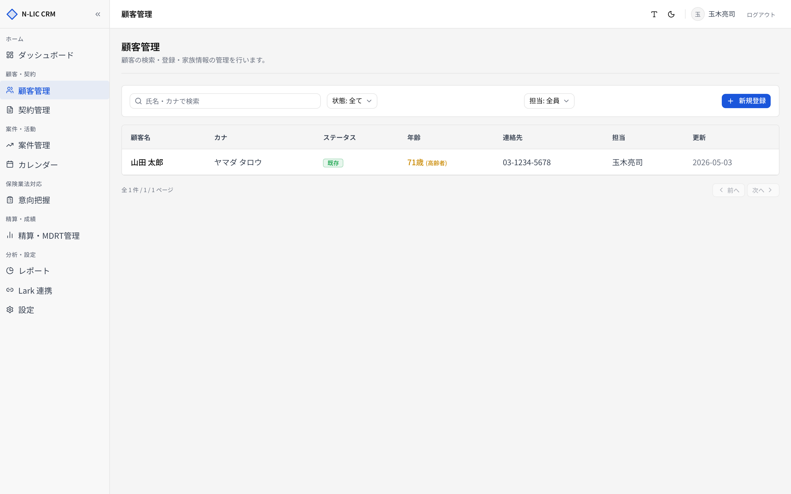

# 02. はじめに — ログインと共通操作

## ログイン

1. ブラウザで `https://<代理店ドメイン>/login` にアクセスします。
2. **［ID／パスワード］** にメールアドレスとパスワードを入力し、**［ログイン］** をクリックします。
3. ログインに成功するとダッシュボードに遷移します。

> ⚠️ **［Lark アカウントでログイン］** ボタンは現状無効化されています。Lark Developer Console での登録と環境変数設定が完了すると有効化されます（[12. Lark 連携](./12_lark_integration.md) 参照）。

### 初回ログイン

- 管理者が招待メールを送ると、招待リンク経由でパスワード設定後に通常ログインが可能になります。
- パスワードを忘れた場合は管理者に再発行を依頼してください。

### ログインできない場合

| 症状 | 原因の例 | 対応 |
|---|---|---|
| 「ログインに失敗しました」 | パスワード誤り／メールアドレス誤り | 入力内容を再確認 |
| 「このユーザーにはプロファイルが登録されていません」 | Supabase Auth は通ったが `user_profiles` が未作成 | 管理者に連絡 |
| ログイン後すぐにログイン画面に戻る | セッション Cookie がブロックされている／別ドメインで保存されている | ブラウザの Cookie 設定を確認、シークレットウィンドウで再試行 |

## 画面構成

ログイン後の画面は **サイドバー + ヘッダー + メインエリア** の 3 領域で構成されます。

### ① サイドバー

- グループ単位でナビゲーションが整理されています：
  - ホーム / 顧客・契約 / 案件・活動 / 保険業法対応 / 精算・成績 / 分析・設定
- 左下のアイコンで **開閉トグル** ができます。折りたたみ状態はブラウザに記憶されます (`hokena_sidebar_collapsed`)。

### ② ヘッダー

ヘッダー右側には以下が並びます。

| アイコン | 機能 | 説明 |
|---|---|---|
| **A** | フォントサイズ | 小 (90%) / 標準 (100%) / 大 (110%) を切替 |
| **☾／☀** | テーマ切替 | ホワイト ↔ ブラックテーマ |

### ③ メインエリア

すべての画面に **ページヘッダー（タイトル + 説明）** が表示され、その下にコンテンツが続きます。

## 共通の操作パターン

業務システムとして同じ操作感を全画面で揃えています。

### 検索とフィルター

- 一覧画面の上部に検索ボックスとフィルター（状態・担当者など）があります。
- 入力した瞬間に URL のクエリパラメーターに反映され、**ブックマーク・ブラウザ戻る** に対応します。
- 検索クエリは **氏名 / フリガナ** の部分一致で評価されます（`name.ilike` + `name_kana.ilike`）。

### ステータスバッジ

ステータスは色で意味を区別しています。以下が代表的な対応です。

| 表示 | バリアント | 主な意味 |
|---|---|---|
| 緑 | `success` | 既存／有効／承認済／完了 |
| 黄 | `warning` | 注意／満期間近／対応中 |
| 赤 | `danger` | 期限切れ／差戻し |
| 青 | `info` | 進行中 |
| グレー | `muted` | 休眠／辞退／対象外 |

### 行クリックで詳細へ

一覧の行はクリックで詳細画面へ遷移します。詳細画面では **［編集］** ／ **［削除］** など、その対象に対する操作が右上に集まっています。

### モーダル

家族構成・契約特約・対応履歴・案件活動の登録などは、画面遷移ではなく **モーダル** で行います。**Esc** で閉じられます。

### 保存とトースト

保存操作の結果は画面右下の **トースト通知** で表示されます。

- 成功時：緑のトースト（例：「契約を登録しました」）
- エラー時：赤のトースト（バリデーションエラーはフィールド横にも表示）

## ショートカット

| キー | 操作 |
|---|---|
| `Esc` | モーダルを閉じる |
| `Tab` | 次のフィールドへフォーカス移動 |
| `Shift + Tab` | 前のフィールドへ |
| `Enter` | フォーカス中のボタンを押下 |

> 💡 検索フィールドは URL クエリと同期しています。`?q=...&status=...` をブックマークすれば、よく使うフィルターを保存できます。
