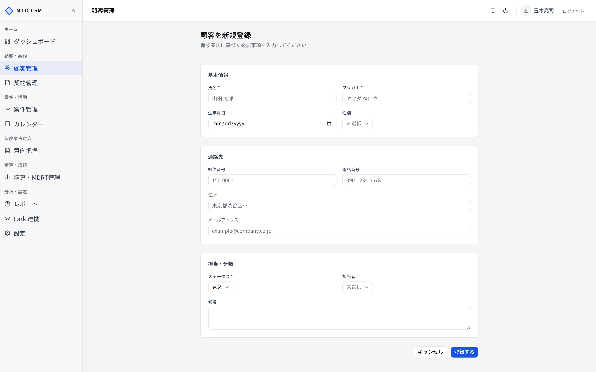
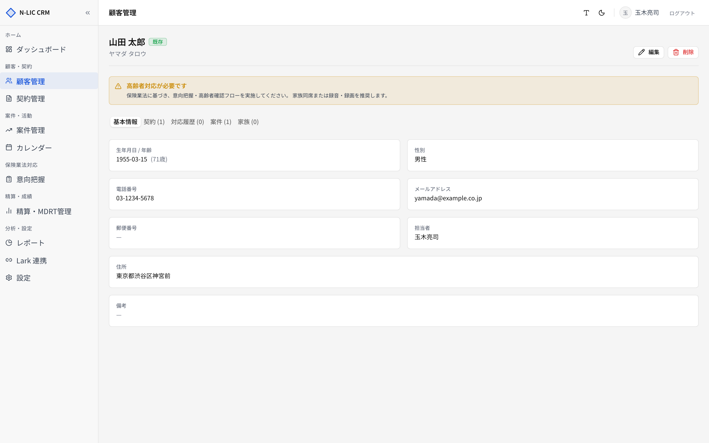
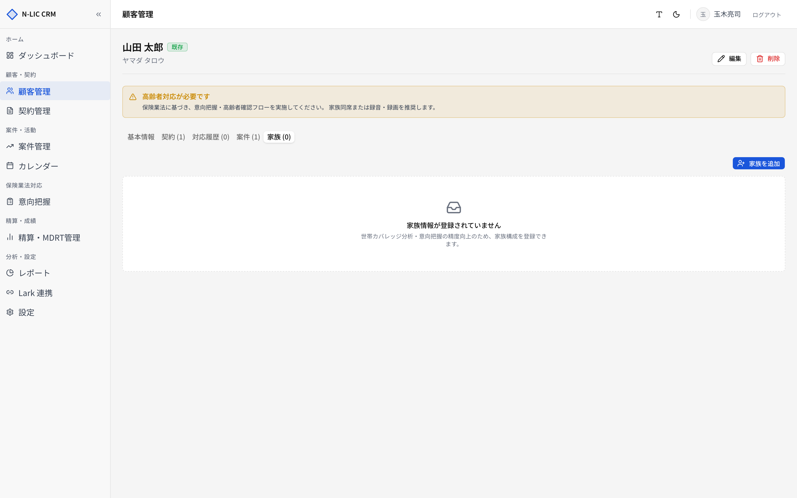

# 03. 顧客管理

> 顧客マスタとして、契約・案件・意向把握のすべての出発点になる画面です。
> サイドバー **［顧客管理］** から開きます。

## 顧客一覧

### 主な機能

| エリア | 機能 |
|---|---|
| 上部の検索ボックス | **氏名 / フリガナ** の部分一致検索（URL クエリ `q`） |
| 状態フィルター | `見込` / `既存` / `休眠` を絞り込み |
| 担当フィルター | 担当者で絞り込み |
| 右上 **［新規登録］** | 新しい顧客の登録画面へ |
| 一覧の行 | クリックで顧客詳細へ |

### 一覧に表示される項目

| 列 | 内容 |
|---|---|
| 顧客名 | フルネーム |
| カナ | フリガナ |
| ステータス | 見込／既存／休眠（色付きバッジ） |
| 年齢 | 生年月日から自動算出（`customers_with_age` ビュー）。設定の閾値を超えると **黄色** で「(高齢者)」と表示 |
| 連絡先 | 電話 → なければメール |
| 担当 | 担当者氏名 |
| 更新 | 最終更新日 |

ページ送りは下部 **全 N 件 / X / Y ページ** とページャーで行います。1 ページあたり 20 件。

## 顧客を新規登録する

サイドバー **［顧客管理］** → 一覧右上の **［新規登録］** で進みます。

### 入力項目

| 項目 | 必須 | 形式・制限 |
|---|---|---|
| 氏名 | ✓ | 50 文字以内 |
| フリガナ | ✓ | カタカナ／全角スペース／長音のみ |
| 生年月日 | | `YYYY-MM-DD` |
| 性別 | | 男性 / 女性 / その他 |
| 郵便番号 | | `150-0001` 形式 |
| 電話番号 | | 数字 / `-` / `+` / `()` のみ、30 文字以内 |
| 住所 | | 200 文字以内 |
| メールアドレス | | RFC 準拠のメール形式 |
| ステータス | ✓ | 見込 / 既存 / 休眠 |
| 担当者 | | 在籍中のユーザーから選択（未割当のままも可） |
| 備考 | | 1000 文字以内 |

入力後 **［登録する］** で保存します。バリデーションエラーは各項目の下に表示されます。

> ⚠️ 空欄で送信した任意項目は内部的に `null` に正規化されます（`normalizeCustomerForm`）。空文字として残ることはありません。

## 顧客詳細

一覧で行をクリックすると顧客詳細画面が開きます。

### ヘッダー

- 氏名と現在のステータスバッジ
- 高齢者対応が必要な顧客の場合、**注意バナー** が出ます

  > ⚠️ 高齢者対応が必要です。保険業法に基づき、意向把握・高齢者確認フローを実施してください。家族同席または録音・録画を推奨します。

- 右上に **［編集］** ／ **［削除］** が並びます。

### タブ構成

| タブ | 内容 |
|---|---|
| 基本情報 | 氏名・連絡先・住所・備考・担当 |
| 契約 | この顧客の契約一覧（証券番号・商品・保険料・満期日） |
| 対応履歴 | 連絡記録（電話・面談・メール）。次回アクションと日付を残せる |
| 案件 | 進行中／過去の提案案件 |
| 家族 | 家族構成（続柄・生年月日・被保険者／受取人フラグ） |

### 家族構成 (家族タブ)

- **家族カバレッジバー** で世帯メンバーのうち被保険／受取人になっている人数の比率が見えます。
- 右上 **［家族を追加］** で続柄・氏名・性別・生年月日・被保険者・受取人を入力。
- 行右の鉛筆アイコンで編集、ゴミ箱アイコンで削除（論理削除ではなく実削除）。

### 対応履歴 (対応履歴タブ)

- **［対応履歴を追加］** から「電話／面談／メール／その他」を選んで内容を記録します。
- **次回アクション + 期日** を入力しておくと、案件管理やレポートで活用できます。
- 履歴は最新 20 件まで表示。

## 顧客を編集する／削除する

### 編集

詳細画面右上の **［編集］** から入ります。入力フォームは新規登録と同じ項目です。

### 削除

詳細画面右上の **［削除］** から論理削除します。

- 削除すると一覧から非表示になります（`deleted_at` がセットされる）。
- データ自体は残るため、技術担当の操作で復元が可能です。
- 削除した顧客に紐付く契約・案件・対応履歴・家族・意向把握は **そのまま残ります**（参照関係は維持）。

> ⚠️ 削除は確認モーダルで承認が必要です。誤操作防止のため、削除直前に顧客名を再表示します。

## 業務フロー例

### 新規見込み客を登録して案件を作るまで

1. **［顧客管理］** → **［新規登録］** → 氏名・フリガナ・連絡先・ステータス＝ `見込` で保存
2. 顧客詳細 → **［対応履歴を追加］** で初回連絡を記録
3. **［案件］** タブ → **［案件を追加］** で提案テーマと予想保険料を登録（[05. 案件管理](./05_opportunities.md) 参照）
4. 提案受領後は **［意向把握］** ウィザードを起動して保険業法対応の記録を作成（[06. 意向把握](./06_intentions.md) 参照）

### 既存顧客に契約を追加する

1. 一覧で顧客を検索 → 詳細へ
2. **［契約］** タブ → **［契約を追加］** → 商品情報・特約・保険料・満期日を入力（[04. 契約管理](./04_contracts.md) 参照）

## トラブルシュート

| 症状 | 原因の例 | 対応 |
|---|---|---|
| 「フリガナはカタカナで入力してください」 | 半角カナや漢字が混入 | 全角カタカナのみで入力 |
| 高齢者の警告が出ない | 設定の閾値が高い／生年月日未入力 | [11. 設定](./11_settings.md) のコンプライアンスタブで `elderly_age_threshold` を確認 |
| 担当者リストに自分が出ない | `is_active = false` | 管理者にアカウント有効化を依頼 |
