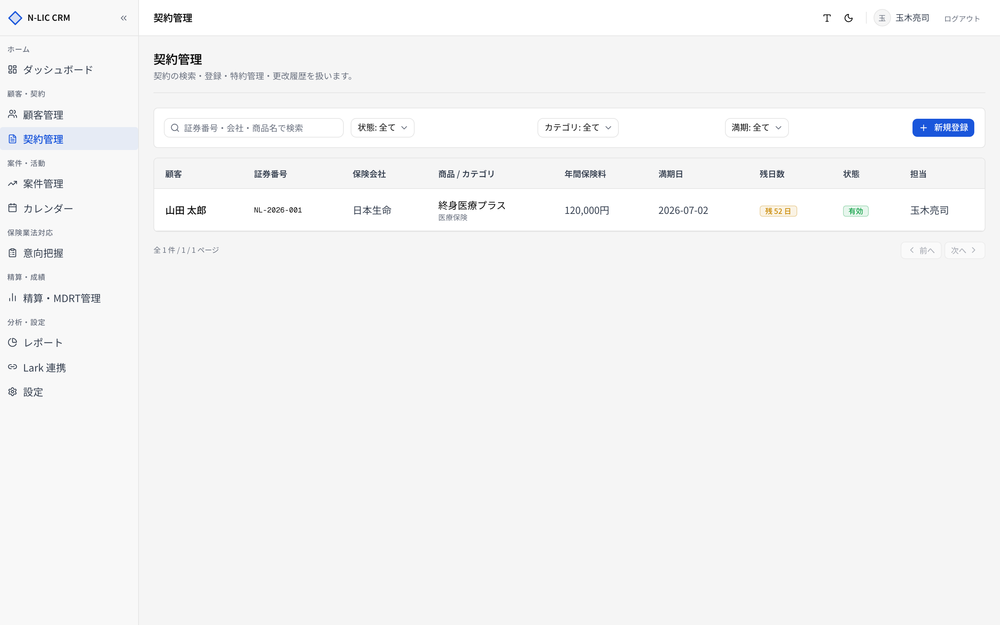
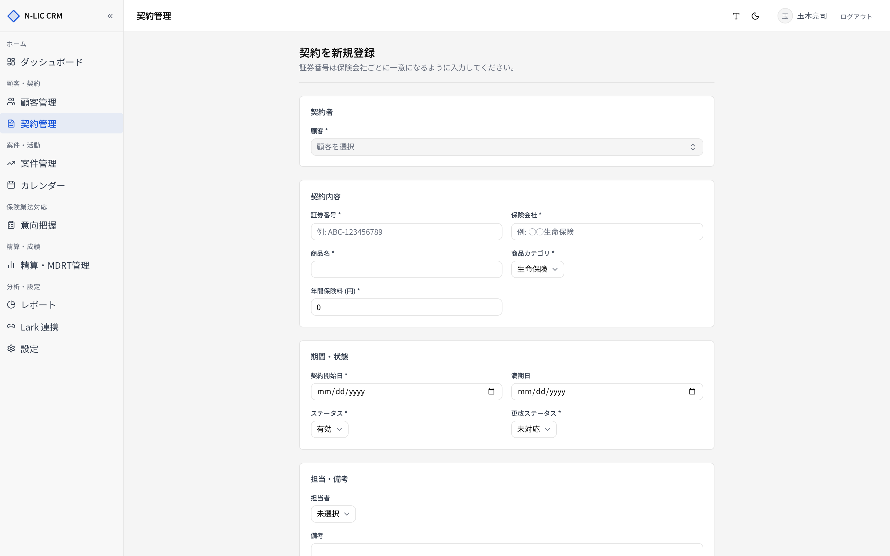
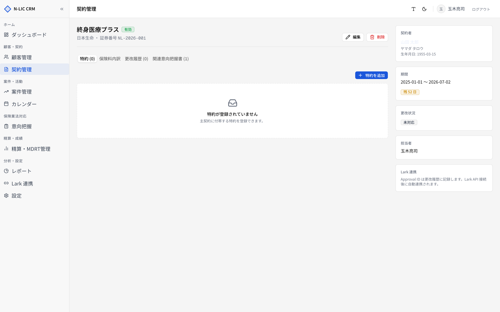
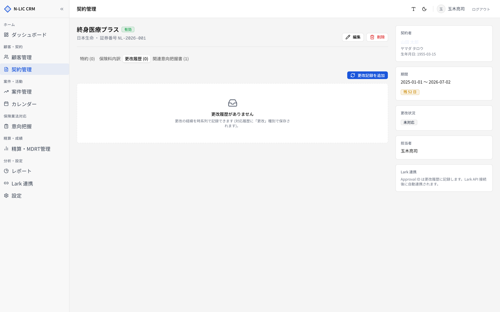

# 04. 契約管理

> 顧客に紐づく保険契約を管理します。証券番号・特約・満期日・更改履歴を一画面で扱います。
> サイドバー **［契約管理］** から開きます。

## 契約一覧

### 検索とフィルター

| エリア | 機能 |
|---|---|
| 検索ボックス | **証券番号 / 保険会社 / 商品名** の部分一致検索 |
| 状態フィルター | `有効` / `満期` / `解約` / `更改中` |
| カテゴリフィルター | `生命保険` / `損害保険` / `医療保険` / `介護保険` / `年金保険` |
| 満期内フィルター | 1ヶ月 / 3ヶ月 / 6ヶ月以内など、満期が近い契約を絞り込み |
| 右上 **［新規登録］** | 契約の新規登録画面へ |

### 一覧の項目

| 列 | 内容 |
|---|---|
| 顧客 | 紐付く顧客名 |
| 証券番号 | 一意の証券番号 |
| 保険会社 | 引受会社 |
| 商品 | 商品名 + カテゴリバッジ |
| 保険料 | 月額／年額（登録時に区別） |
| 状態 | 有効 / 満期 / 解約 / 更改中 |
| 満期日 | 残日数バッジ付き |
| 担当 | 担当者氏名 |

満期日は **昇順** で並びます。満期が近い契約から上に来ます。

## 契約を新規登録する

サイドバー **［契約管理］** → **［新規登録］** で進みます。

### 入力項目

| 項目 | 必須 | 制限 |
|---|---|---|
| 顧客 | ✓ | 既存顧客から選択 (`customer_id`) |
| 証券番号 | ✓ | 50 文字以内 |
| 保険会社 | ✓ | 100 文字以内 |
| 商品名 | ✓ | 100 文字以内 |
| 商品カテゴリ | ✓ | 上記 5 種から選択 |
| 保険料 | ✓ | 0 〜 1 億円 |
| 契約開始日 | ✓ | `YYYY-MM-DD` |
| 満期日 | | 契約開始日より後 |
| 状態 | ✓ | 有効 / 満期 / 解約 / 更改中 |
| 更改状況 | ✓ | 未対応 / 対応中 / 更改中 / 完了 / 辞退 |
| 担当者 | | ユーザー選択 |
| 備考 | | 1000 文字以内 |

> ⚠️ **満期日 ≦ 契約開始日** で送信するとバリデーションエラーになります。

### 顧客詳細経由での登録

顧客詳細 → **［契約］** タブ → **［契約を追加］** からも、customer_id をプリセットした状態で登録できます。

## 契約詳細

ヘッダーには **証券番号** ・ **状態バッジ** ・ **満期残日数** が表示されます。
右上に **［編集］** ／ **［削除］**（論理削除）が並びます。

### タブ構成

| タブ | 内容 |
|---|---|
| 特約 | 主契約に紐づく特約（複数登録可） |
| 保険料内訳 | 月額／年額の換算、特約合計を含む |
| 更改履歴 | 更改ごとの内容・保険料変更・Lark 承認 ID |
| 関連意向把握書 | この契約締結に紐づく意向把握記録 |

### 特約タブ

**［特約を追加］** から特約を登録。

| 項目 | 必須 | 制限 |
|---|---|---|
| 特約名 | ✓ | 100 文字以内 |
| 補償内容 | | 500 文字以内 |
| 保険料 | | 0 〜 1 億円 |
| 満期日 | | `YYYY-MM-DD` |
| 有効フラグ | ✓ | 解約された特約は無効化 |

特約は **論理削除（is_active = false）** で運用されます。完全に消したい場合は技術担当に依頼してください。

### 更改履歴タブ

満期 60 日前になるとダッシュボードと一覧で警告表示されます。更改が発生したら **［更改履歴を追加］** で記録します。

| 項目 | 必須 | 内容 |
|---|---|---|
| 更改日 | ✓ | 契約継続日 |
| 内容 | ✓ | 2000 文字以内 |
| 新保険料 | | 変更後の月額／年額 |
| 担当者 | | |
| Lark 承認 ID | | 連携時の承認チケット番号 |
| 次の更改ステータス | ✓ | 上記 5 種 |

> 📝 更改記録は 1 契約に何件でも登録できます。履歴を残すことで、保険料変動・対応経緯を後追いできます。

### 関連意向把握書タブ

この契約が、どの意向把握記録に基づいて締結されたかを表示します。意向把握 → 提案 → 契約 のトレースが取れます。

## 業務フロー例

### 新規契約を入れるとき

1. 顧客詳細 → **［契約］** タブ → **［契約を追加］**
2. 商品・保険料・契約期間を入力 → **［登録する］**
3. 特約があれば契約詳細 → **［特約］** タブから追加
4. 意向把握書がある場合は [06. 意向把握](./06_intentions.md) で関連付け

### 満期更改の流れ

1. ダッシュボード or 契約一覧 → 満期 60 日以内の警告が出ている契約をクリック
2. 契約詳細 → 更改状況を「対応中」に更新
3. 顧客と面談 → 新しい商品で **［契約を追加］**（新契約）
4. 旧契約の詳細 → **［更改履歴を追加］** で経緯と Lark 承認 ID を記録
5. 旧契約の状態を「満期」or「解約」に変更

## トラブルシュート

| 症状 | 原因 | 対応 |
|---|---|---|
| 満期日が入力できない | 契約開始日より前 | 開始日を確認 |
| 「顧客を選択してください」 | UUID が未選択 | コンボボックスで顧客を選び直す |
| 保険料が大きすぎるエラー | 1 億円超 | 入力値を確認（円単位・税込み） |
