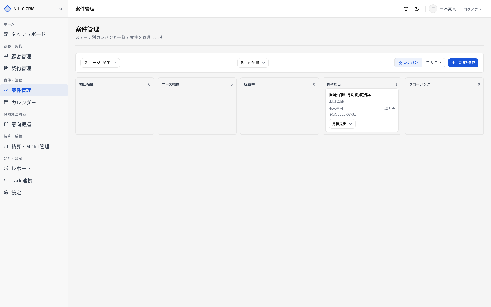
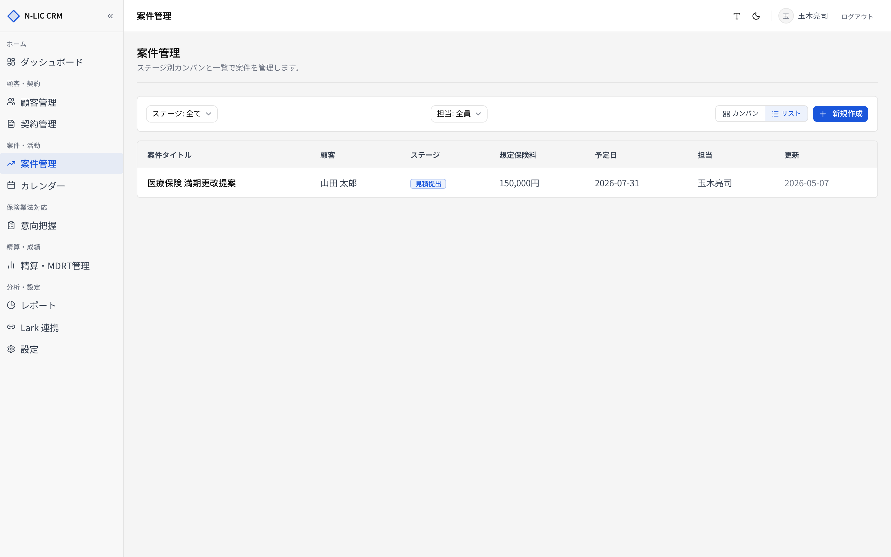
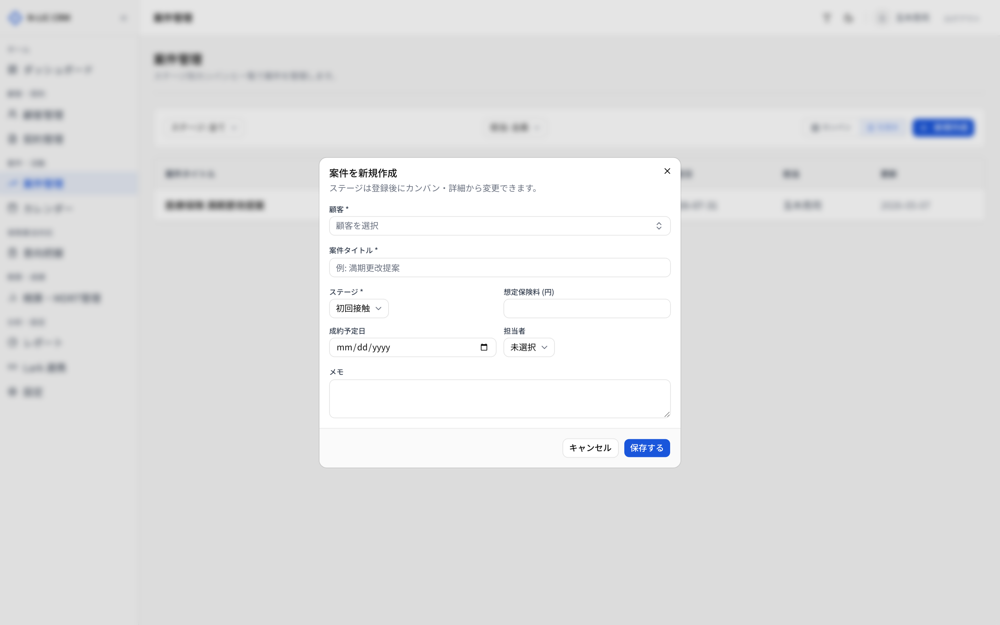
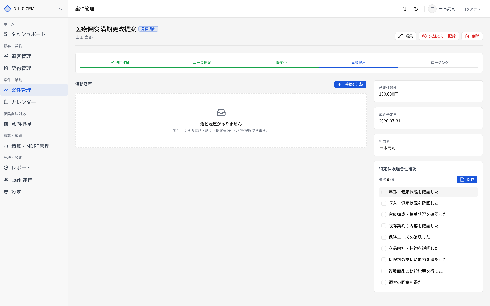

# 05. 案件管理

> 提案フェーズの活動を、カンバン／リストで一元管理します。
> サイドバー **［案件管理］** から開きます。

## ステージ定義

案件は以下の **7 ステージ** で管理します。

| # | ステージ | 内容 |
|---|---|---|
| 1 | 初回接触 | 顧客との最初のコンタクト |
| 2 | ニーズ把握 | ヒアリング・課題抽出 |
| 3 | 提案中 | 商品提案・比較 |
| 4 | 見積提出 | 見積もり提示 |
| 5 | クロージング | 締結合意の最終段階 |
| 6 | 成約 | 契約締結（[04. 契約管理](./04_contracts.md) に契約を登録） |
| 7 | 失注 | 失注理由を記録 |

カンバンビューには **進行中の 5 ステージ** のみが列として表示され、成約・失注はリストビューでのみ確認できます。

## 案件一覧

### カンバンビュー（標準）

各列に該当ステージの案件カードが並びます。

| エリア | 機能 |
|---|---|
| 上部 **［カンバン / リスト］** | ビュー切替（ブラウザに記憶） |
| ステージフィルター | 特定ステージのみ表示 |
| 担当者フィルター | 担当者で絞り込み |
| 右上 **［新規作成］** | 案件登録モーダルを開く |

カードには **案件タイトル / 顧客名 / 想定保険料 / 期日** が表示されます。クリックで案件詳細へ。

### リストビュー

成約・失注も含めて表形式で確認できます。

| 列 | 内容 |
|---|---|
| 案件 | タイトル |
| 顧客 | 顧客名 |
| ステージ | ステージバッジ |
| 想定保険料 | 万円表示 |
| 期日 | 期待クロージング日 |
| 担当 | 担当者 |
| 更新 | 最終更新日 |

## 案件を新規作成する

**［新規作成］** でモーダルが開きます。

| 項目 | 必須 | 制限 |
|---|---|---|
| 顧客 | ✓ | 既存顧客から選択（コンボボックス検索可） |
| 案件タイトル | ✓ | 100 文字以内 |
| ステージ | ✓ | 上記 7 ステージ |
| 想定保険料 | | 月額・年額の単位は運用で統一 |
| 期待クロージング日 | | `YYYY-MM-DD` |
| 担当者 | | |
| 備考 | | 1000 文字以内 |
| 失注理由 | | ステージが「失注」のときのみ入力可（500 文字以内） |

> 💡 顧客詳細 → **［案件］** タブ → **［案件を追加］** からは、顧客がプリセットされた状態でモーダルが開きます。

## 案件詳細

ヘッダーには **タイトル / ステージバッジ / 想定保険料** が並びます。

### ステージ進行

ステージは **詳細画面のステージピル** をクリックして進めます。前のステージに戻すこともできます。

### 活動履歴タブ

提案活動の経過を時系列で記録します。

| 種別 | 用途 |
|---|---|
| 電話 | 顧客への架電 |
| 訪問 | 対面面談 |
| メール | メール送付・受信 |
| Lark | Lark での連絡 |
| 提案書送付 | 提案書送付の記録 |
| その他 | その他 |

| 項目 | 必須 | 内容 |
|---|---|---|
| 種別 | ✓ | 上記から選択 |
| 内容 | ✓ | 2000 文字以内 |
| 活動日時 | ✓ | `YYYY-MM-DDTHH:mm` |

活動を入れていくことで、レポート画面で「平均ヒアリング回数」「成約までの活動数」などの分析が可能になります（将来拡張）。

### 失注処理

ステージを「失注」に変更すると **失注理由** の入力が必須になります。

> 💡 失注理由はレポートで「失注分析」として再利用できる（将来拡張）。**価格 / 商品 / 競合 / タイミング** など、定型化して入れる運用を推奨します。

## 業務フロー例

### 見込み客の提案案件を成約まで持っていく

1. 顧客詳細 → **［案件］** タブ → **［案件を追加］** → タイトル＋ステージ「初回接触」で登録
2. ヒアリング後にステージを「ニーズ把握」へ → 活動履歴に記録
3. **［提案中］** で提案資料送付 → 活動履歴に「提案書送付」記録
4. **［見積提出］** → **［クロージング］** に進める
5. 契約締結 → ステージを「成約」へ → [04. 契約管理](./04_contracts.md) で契約を登録

### 失注のとき

1. ステージを「失注」へ
2. **失注理由** を記入（必須）
3. 顧客のステータスは「休眠」に変更しておくと再アプローチ時に整理しやすい
