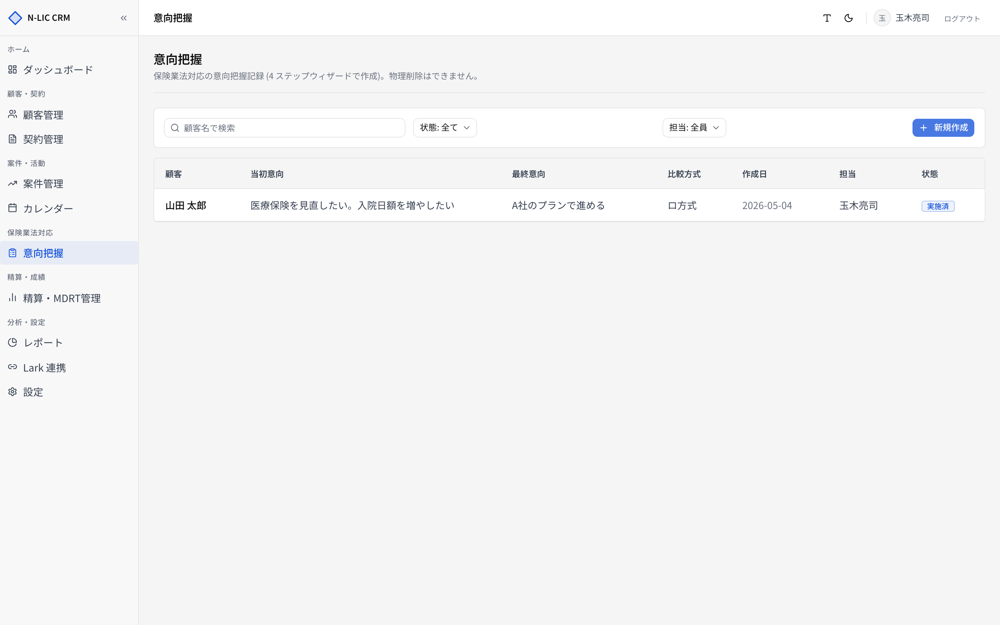
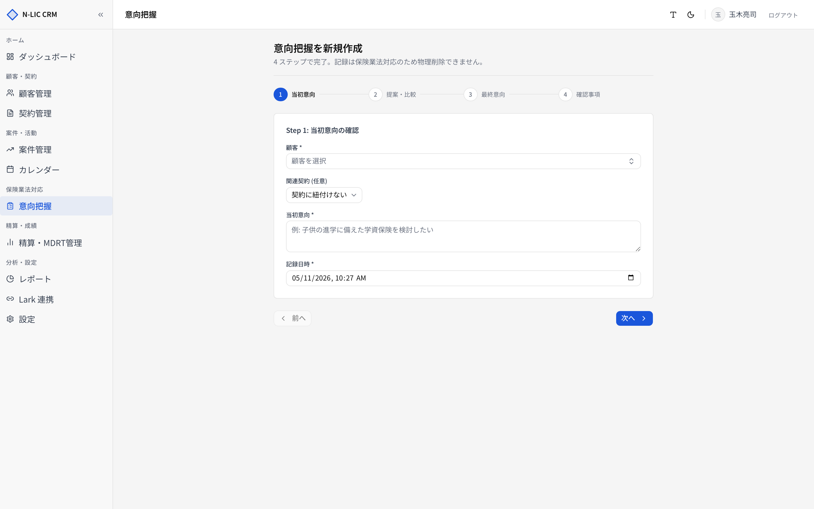
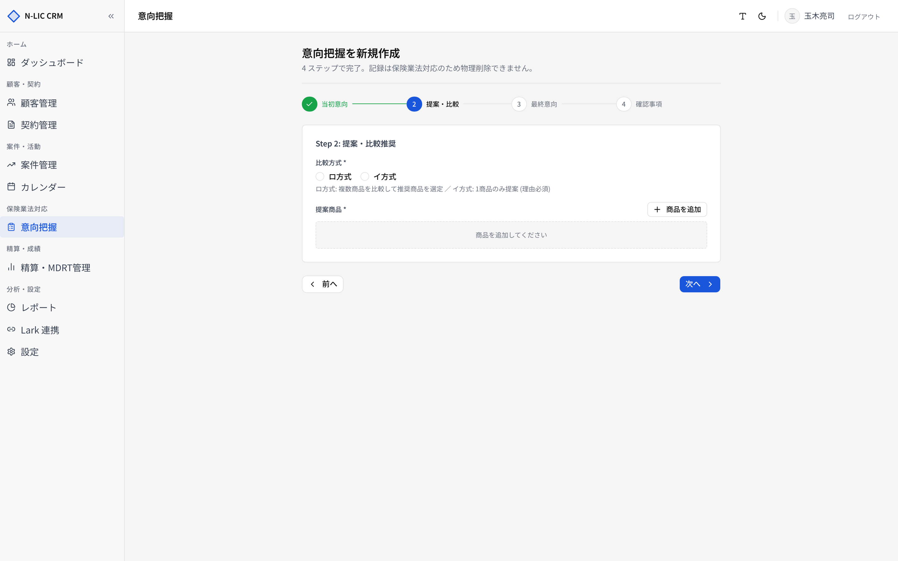
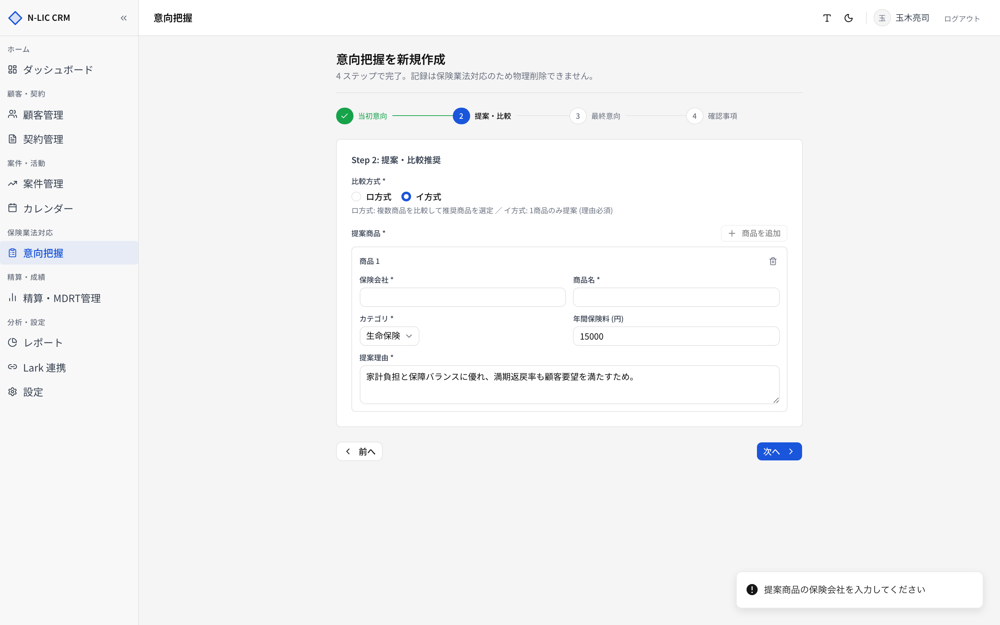
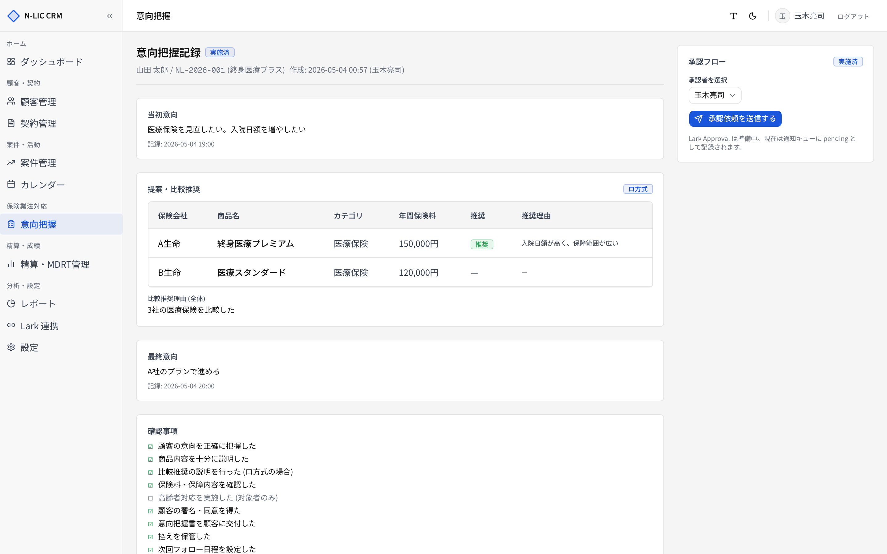

# 06. 意向把握（保険業法対応）

> **保険業法に基づく意向把握記録** を作成・承認・保管します。
> 当システムの中で **コンプライアンス上もっとも重要** な機能です。物理削除は技術的にも禁止されています。

サイドバー **［意向把握］** から開きます。

## 重要な性質

| 項目 | 内容 |
|---|---|
| 物理削除 | 不可（`deleted_at` 論理削除のみ。技術担当でも復元できる仕様） |
| 編集 | 承認済の記録は編集不可。差戻し後のみ再編集可 |
| 承認 | 管理者ロールが承認／差戻しを実行 |
| 保管年数 | 設定 > コンプライアンス > `data_retention_years` で定義（既定 10 年） |
| 監査ログ | 作成・承認・差戻し・編集はすべて `audit_logs` に記録 |

## 意向把握 一覧



| エリア | 機能 |
|---|---|
| 検索 | 顧客名・契約番号で検索 |
| ステータスフィルター | 未実施 / 実施済 / 承認待 / 承認済 / 差戻 |
| 比較方式フィルター | イ方式 / ロ方式 |
| 担当者フィルター | |
| 右上 **［新規作成］** | 4 ステップウィザードを開始 |

### ステータス遷移

```
未実施 → 実施済 → 承認待 → 承認済
                       ↘  差戻 → (再編集) → 承認待
```

| ステータス | 意味 |
|---|---|
| 未実施 | 作成中（ウィザード途中保存） |
| 実施済 | 4 ステップ完了。承認に上げる前の状態 |
| 承認待 | 管理者の承認待ち |
| 承認済 | 承認完了。編集不可になる |
| 差戻 | 管理者が差戻し。担当者が修正して再提出可 |

## 4 ステップウィザード

新規作成は **［新規作成］** で 4 ステップウィザードが開きます。



### Step 1: 当初意向

| 項目 | 必須 | 内容 |
|---|---|---|
| 顧客 | ✓ | 既存顧客から選択 |
| 関連契約 | | 既存契約に紐づける場合 |
| 当初意向 | ✓ | 2000 文字以内。顧客が最初に表明した意向 |
| 記録日時 | ✓ | 面談日時 |

### Step 2: 比較推奨



商品を追加すると、商品カードに入力フィールドが展開されます。



#### 比較方式

| 方式 | 説明 | 商品数 | 推奨商品 | 推奨理由 |
|---|---|---|---|---|
| **イ方式** | 単一商品のみを提案 | **1 件のみ** | 必須 | 必須 |
| **ロ方式** | 複数比較から推奨 | **1 件以上** | 推奨 1 件以上 必須 | 推奨商品ごとに必須 |

#### 商品ごとの項目

| 項目 | 必須 | 制限 |
|---|---|---|
| 保険会社 | ✓ | 100 文字以内 |
| 商品名 | ✓ | 100 文字以内 |
| 商品カテゴリ | ✓ | 生命/損害/医療/介護/年金 |
| 保険料 | ✓ | 0 〜 1 億円 |
| 推奨フラグ | | チェック時、推奨理由が必須 |
| 推奨理由 | 条件次第 | 1000 文字以内 |

### Step 3: 最終意向

| 項目 | 必須 | 内容 |
|---|---|---|
| 最終意向 | ✓ | 2000 文字以内 |
| 当初意向との差異メモ | | 1000 文字以内。当初と最終で意向が変わった場合に記録 |
| 記録日時 | ✓ | 最終面談日時 |

### Step 4: チェックリスト

保険業法に基づく **9 項目** のチェックリスト。

| # | 項目 | 必須条件 |
|---|---|---|
| 1 | 顧客の意向を正確に把握した | 常時必須 |
| 2 | 商品内容を十分に説明した | 常時必須 |
| 3 | 比較推奨の説明を行った（ロ方式の場合） | ロ方式時のみ必須 |
| 4 | 保険料・保障内容を確認した | 常時必須 |
| 5 | 高齢者対応を実施した（対象者のみ） | 顧客が高齢者の場合のみ必須 |
| 6 | 顧客の署名・同意を得た | 常時必須 |
| 7 | 意向把握書を顧客に交付した | 常時必須 |
| 8 | 控えを保管した | 常時必須 |
| 9 | 次回フォロー日程を設定した | 常時必須 |

Step 4 では電子サイン欄も表示されます。顧客がタッチパネルに直書きした署名画像、署名時点の意向把握内容、チェックリスト、提案商品を証跡 manifest として固定し、SHA-256 とサーバー封印値を保存します。

承認者（管理者）を選択して **［承認に提出］** で `承認待` 状態になります。

> ⚠️ ステップ間は **下書き保存** されます。途中で離脱しても再開できます。

## 意向把握 詳細



承認待／承認済／差戻 すべての記録を表示します。

### 承認操作（管理者）

承認待ち状態の記録には **［承認］** と **［差戻し］** ボタンが表示されます。

- **［承認］** → ステータスが `承認済` に。以降編集不可。承認ログ（actor / 日時）を記録
- **［差戻し］** → 差戻し理由を入力（必須） → ステータス `差戻` に。担当者が修正してから再提出可能

### 監査履歴

ページ下部に **作成 / 編集 / 承認 / 差戻し** の履歴が表示されます。誰がいつ何をしたかが確認できます。

## 業務フロー例

### 新規提案 → 意向把握 → 契約までの一連の流れ

1. 顧客詳細 → **［案件］** タブから案件を作成（[05. 案件管理](./05_opportunities.md)）
2. 提案資料送付後、サイドバー **［意向把握］** → **［新規作成］**
3. **Step 1** で当初意向を記録 → Step 2 で比較方式と提案商品 → Step 3 で最終意向 → Step 4 でチェックリストと承認者選択 → **［承認に提出］**
4. 管理者が **承認待ち** から **［承認］** → 承認済になる
5. 承認済の記録に基づき [04. 契約管理](./04_contracts.md) で契約を登録 → 関連意向把握書として自動紐付け

### 差戻し時

1. 管理者が **［差戻し］** + 理由記入
2. 担当者は意向把握詳細から **［編集］** → 4 ステップを修正 → 再度 **［承認に提出］**

## トラブルシュート

| 症状 | 原因 | 対応 |
|---|---|---|
| 「ロ方式では推奨商品を1件以上選び、推奨理由を必ず入力してください」 | 推奨チェックがない/理由が空 | 推奨フラグと理由を入力 |
| 「イ方式では商品を1件のみ提案し...」 | 商品が 0 件 or 2 件以上 | イ方式は厳密に 1 件 |
| 「次回フォロー日程を設定した」がチェックできない | 顧客が高齢者でない場合の高齢者対応項目など、適用外項目はグレーアウト | 該当外項目は無視で可 |
| 承認画面に **［承認］** が出ない | 管理者ロールでない／自分が作成した記録は承認できない（運用統制次第） | 管理者でログインし直す |

> 📚 **法令適用** はリスクが高い領域です。実運用に乗せる前に、社内のコンプライアンス担当と必ずフローを摺り合わせてください。
