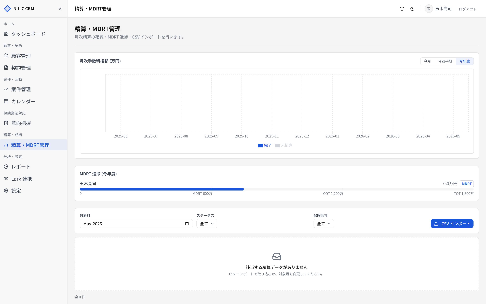
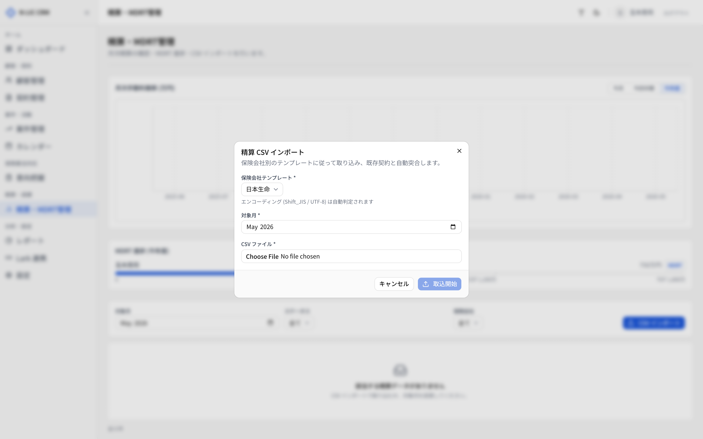

# 07. 精算・MDRT 管理

> 保険会社からの手数料明細（精算データ）を取り込み、月次照合・MDRT 進捗確認・差異検出を行います。
> サイドバー **［精算・MDRT管理］** から開きます。

## 画面構成

| ブロック | 内容 |
|---|---|
| 上部 | MDRT 進捗（年度累計／目標バー／達成率） |
| 中段 | 月次手数料推移グラフ（過去 12 ヶ月） |
| 下段 | 月次精算明細テーブル＋ CSV インポート |

## MDRT 進捗

MDRT（Million Dollar Round Table）の **3 段階目標** に対する進捗を表示します。

| 称号 | 既定の年間目標 | 説明 |
|---|---|---|
| MDRT | 600 万円 | スタンダード |
| COT (Court of the Table) | 1,200 万円 | MDRT の 3 倍水準 |
| TOT (Top of the Table) | 1,800 万円 | MDRT の 6 倍水準 |

> 💡 目標値は `mdrt_targets` テーブルで年度ごとに管理されます。年度初めに管理者が更新できる UI を将来追加予定です（現状は技術担当が SQL で初期化）。

担当者ごとに **実績／目標バー** が表示されます。

## 月次精算

### 月を切り替える

画面中央の月セレクタで対象月を変更します。URL クエリは `?month=YYYY-MM`。

### 一覧の項目

| 列 | 内容 |
|---|---|
| 証券番号 | 契約の証券番号 |
| 顧客名 | CSV 上の契約者名 |
| 保険会社 | 引受会社 |
| 計上月 | YYYY-MM |
| 請求額 | 保険会社請求 |
| 入金額 | 実入金 |
| 手数料額 | 代理店受取手数料 |
| 手数料率 | (任意) |
| 状態 | 未精算 / 照合中 / 完了 / 差異あり |

### ステータス

| ステータス | 意味 |
|---|---|
| 未精算 | CSV 取り込み直後の初期状態 |
| 照合中 | 担当者が確認作業中 |
| 完了 | 入金と一致し、精算完了 |
| 差異あり | 請求額・入金額・手数料額に齟齬がある |

差異ありの行は **赤色** で強調表示されます。

## CSV インポート

各保険会社の CSV テンプレートに合わせて、明細データを取り込めます。

### 対応保険会社（暫定）

- 日本生命（Shift_JIS）
- 東京海上日動（UTF-8）
- アフラック（Shift_JIS）
- 第一生命 / 損保ジャパン など（順次追加予定）

> ⚠️ **列名と文字コードは保険会社ごとに異なります**。テンプレートは `src/lib/settlement/csvTemplates.ts` で集中管理されています。新しい保険会社を追加する場合は、技術担当に依頼してください。

### 取り込み手順

1. **［CSV インポート］** → 取り込みたい保険会社を選択
2. ファイル選択画面で CSV をアップロード
3. **プレビュー** で列マッピング・行件数を確認
4. **［確定］** で `settlements` テーブルに登録
5. 失敗行は `settlement_imports` テーブルに記録（後追い修正可能）

### 重複検知

同じ **証券番号 + 計上月** の行が既存にある場合：

- 完全一致 → スキップ
- 金額違い → **差異あり** ステータスで上書き登録（旧データは履歴として保持）

## 月次推移チャート

過去 12 ヶ月の手数料合計を棒グラフで表示します。状態（完了 / 差異あり / 未精算）で色分けされ、ステータスの累積も把握できます。

## 業務フロー例

### 月初の精算作業

1. **［精算・MDRT管理］** を開き、対象月を当月に設定
2. **［CSV インポート］** → 保険会社ごとに CSV をアップロード
3. **差異あり** の行を順に開き、保険会社に確認
4. 確認済みの行は **［完了］** にステータス変更
5. MDRT 進捗バーを確認、目標との乖離を共有

### 担当者の MDRT 進捗確認

1. 上部 MDRT 進捗ブロックで担当別バーを確認
2. 達成見込みの低い担当者にフォロー
3. レポート画面（[09. レポート](./09_reports.md)）と組み合わせて月次計画を立案

## トラブルシュート

| 症状 | 原因 | 対応 |
|---|---|---|
| CSV 取り込み時に文字化け | 文字コード設定が違う | 保険会社テンプレートと一致しているか確認 |
| 差異あり が大量に出る | 取り込んだ月と CSV の計上月がずれている | 上部の月セレクタが正しいか確認 |
| MDRT 目標値が古い | `mdrt_targets` の年度設定が未更新 | 技術担当に年度更新を依頼 |
