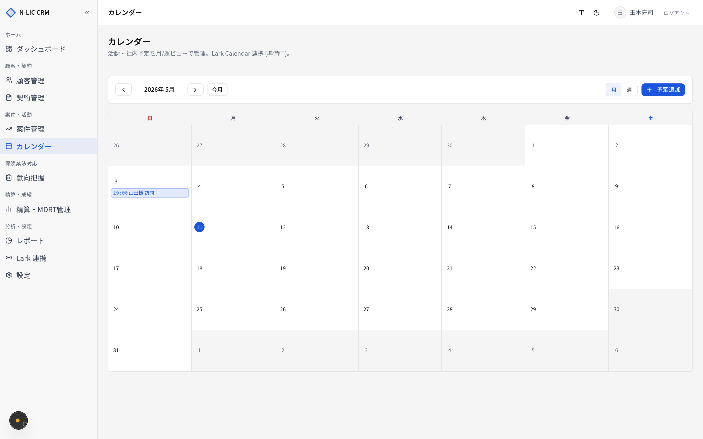
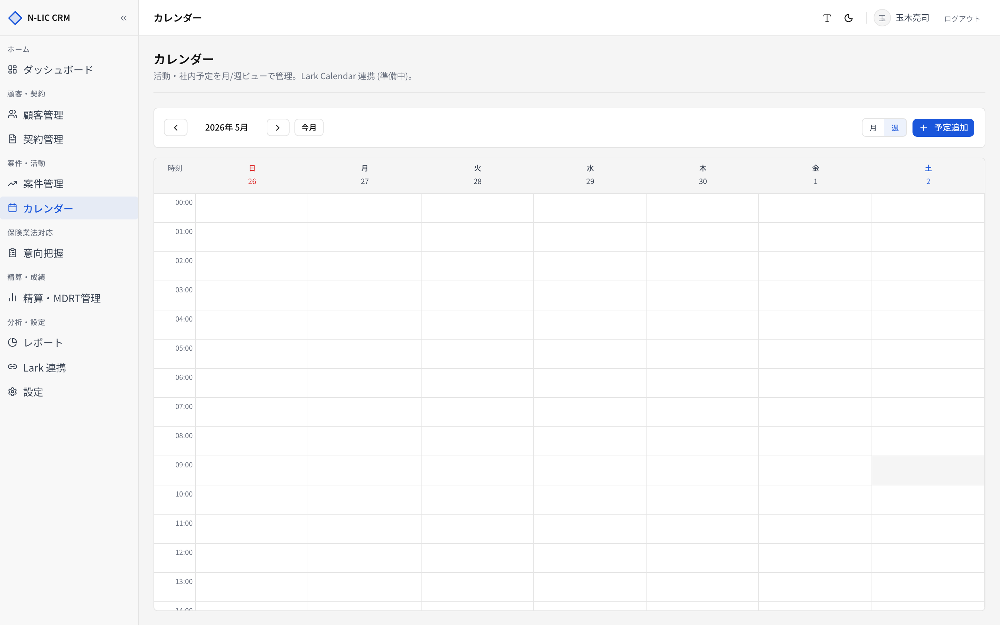
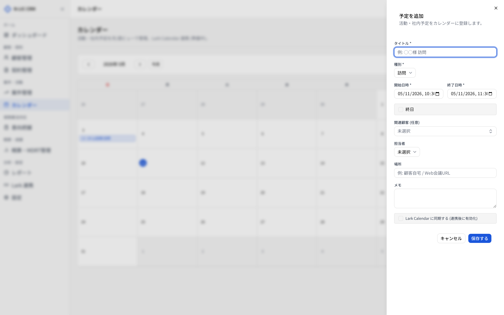

# 08. カレンダー

> 顧客訪問・電話・社内会議など、業務予定を月／週ビューで管理します。
> サイドバー **［カレンダー］** から開きます。

## 画面構成

| エリア | 機能 |
|---|---|
| 上部ナビ | ◀ / 今日 / ▶ で月（または週）を移動 |
| ビュー切替 | **［月］** / **［週］** |
| 右上 **［新規予定］** | 予定登録モーダル |

URL クエリで状態を保持：`?year=2026&month=5&view=month`。ブックマークで特定月を保存できます。

## イベント種別

| 種別 | 用途 |
|---|---|
| 訪問 | 顧客先への訪問 |
| 電話 | 電話面談 |
| Web会議 | オンライン面談 |
| 書類作業 | 申込書・更改書類作成 |
| 社内会議 | 朝礼・打ち合わせ |
| 研修 | 社内外研修 |
| その他 | |

種別ごとに **色** が変わります（G-DX デザイントークン準拠）。

## 月ビュー

各セルにその日の予定が積み上がります。1 セルあたり最大表示は概ね 3 件。
セルをクリックすると、その日に新規予定を作成するモーダルが開きます。

予定をクリックすると **右側サイドパネル** が開き、詳細を表示・編集できます。

## 週ビュー

時間軸（0:00 〜 24:00）を縦に表示。予定の長さは時間に応じて伸びます。
ドラッグで予定の開始・終了を変更できます（現状はモーダル経由の編集を推奨）。

## 予定を登録する

**［新規予定］** または日付セルクリックでモーダルが開きます。

### 入力項目

| 項目 | 必須 | 制限 |
|---|---|---|
| タイトル | ✓ | 100 文字以内 |
| 種別 | ✓ | 上記 7 種から選択 |
| 開始日時 | ✓ | `YYYY-MM-DDTHH:mm` |
| 終了日時 | ✓ | 開始日時以降 |
| 終日フラグ | | 終日予定にする場合 |
| 関連顧客 | | 顧客を紐付け（後で顧客ページから参照可能） |
| 関連案件 | | 案件を紐付け |
| 担当者 | | |
| 場所 | | 200 文字以内 |
| メモ | | 2000 文字以内 |

> ⚠️ 終了日時 < 開始日時 は登録不可。

## サイドパネル

予定をクリックして開く詳細パネル。

| エリア | 内容 |
|---|---|
| ヘッダー | タイトル + 種別バッジ |
| 詳細 | 日時、場所、関連顧客／案件 |
| メモ | 自由記述 |
| 操作 | 編集 / 削除 |

## Lark Calendar 連携（準備中）

[12. Lark 連携](./12_lark_integration.md) > Calendar タブで `calendar_id` を設定すると、HOKENA CRM の予定が Lark Calendar へ自動同期されます（実装は準備中）。

## 業務フロー例

### 顧客訪問の予定管理

1. 顧客詳細 → **［対応履歴を追加］** で次回アクションを `2026-05-20` で記録
2. サイドバー **［カレンダー］** → 該当日付セル → **［新規予定］**
3. 種別「訪問」、関連顧客を紐付け、場所を入力
4. 翌週はじめに週ビューで予定一覧を確認、訪問前に [顧客詳細](./03_customers.md) で過去履歴を再確認

## トラブルシュート

| 症状 | 原因 | 対応 |
|---|---|---|
| 予定が他人のと同じ色 | 種別ごとの色分けで、担当者別の色分けは現状なし | 担当者でフィルター（将来実装予定） |
| 月をまたぐ予定が片方にしか表示されない | 月単位で取得しているため | 開始日が表示中の月にある月で確認 |
| Web会議 URL が入らない | 専用フィールド未実装、メモ欄に貼ってください | 運用回避 |
