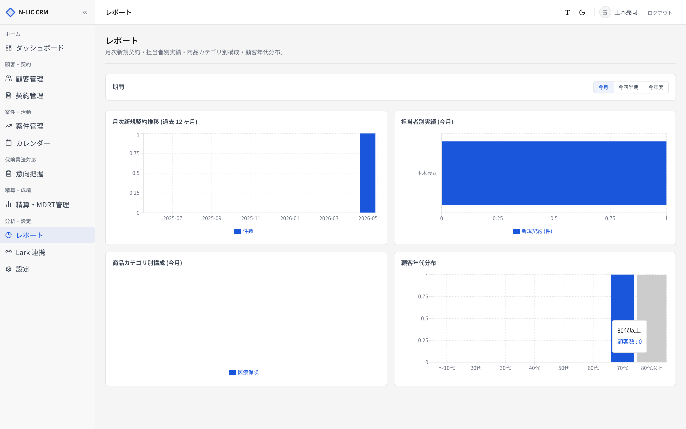

# 09. レポート

> 代理店全体の業績・顧客構成を 4 つの観点で可視化します。
> サイドバー **［レポート］** から開きます。

## 画面構成

| ブロック | グラフ | 集計対象 |
|---|---|---|
| ① 月次新規契約推移 | 棒グラフ | 過去 12 ヶ月（期間設定の影響なし） |
| ② 担当者別実績 | 横棒グラフ | 期間設定に依存 |
| ③ 商品カテゴリ別構成 | 円グラフ + 表 | 期間設定に依存 |
| ④ 顧客年代分布 | 棒グラフ | 全顧客（期間に依存しない） |

## 期間切替

画面右上で集計期間を切り替えます。

| ボタン | 範囲 |
|---|---|
| **今月** | 当月の 1 日〜今日 |
| **今四半期** | 当四半期の開始〜今日 |
| **今年度** | 当年の 1 月 1 日〜今日 |

URL クエリ `?period=this_month` / `this_quarter` / `this_year`。ブックマーク可。

## 各グラフの読み方

### ① 月次新規契約推移

過去 12 ヶ月の **新規契約件数** を月単位で表示。トレンド把握用。

> 💡 件数だけでなく **保険料合計** をマウスオーバーで確認できます。

### ② 担当者別実績

期間内に **登録された契約** を担当者ごとに集計。

| 列 / 棒 | 内容 |
|---|---|
| 件数 | 担当した契約の件数 |
| 保険料合計 | 同期間の保険料総額 |

降順で並び、件数の多い担当者が上に表示されます。未割当の契約は「未割当」としてまとめられます。

### ③ 商品カテゴリ別構成

| カテゴリ |
|---|
| 生命保険 |
| 損害保険 |
| 医療保険 |
| 介護保険 |
| 年金保険 |

円グラフ＋表で **件数 / 保険料合計 / 占有率** を表示。代理店の商品構成バランスを把握できます。

### ④ 顧客年代分布

顧客マスタの生年月日から自動算出 (`customers_with_age` ビュー) し、以下の年代区分で集計。

| バケット |
|---|
| 〜10代 / 20代 / 30代 / 40代 / 50代 / 60代 / 70代 / 80代以上 |

> 💡 高齢者対応が必要な顧客の割合を可視化するのに有用。70 代以上の比率が大きい代理店は、コンプライアンス強化や家族同席運用を検討。

## CSV エクスポート（将来）

現状はグラフ閲覧のみ。CSV / PDF エクスポートは将来追加予定です。

## 業務フロー例

### 月次定例での振り返り

1. 期間を **今月** に設定
2. 担当者別実績で個別バランスを確認
3. カテゴリ別構成で偏りを確認（例：生命保険ばかり → 損保提案を強化）
4. 月次推移と組み合わせて、年間目標との乖離を見る

### MDRT 期初目標の設定

1. 期間を **今年度** に設定
2. 担当者別保険料合計の上位を把握 → MDRT 達成圏内を確認
3. [07. 精算・MDRT 管理](./07_settlement.md) と組み合わせて目標値を逆算

## 注意点

- レポートは **論理削除されていない契約** のみを対象にします。削除済み契約は集計対象外。
- データのリアルタイム性は **数秒** 程度（Server Components の SSR）。直近に登録した契約はリロードで反映されます。
- 期間集計の境界は **契約の `created_at`**（登録日）です。**契約開始日 (`start_date`)** ではない点に注意。
