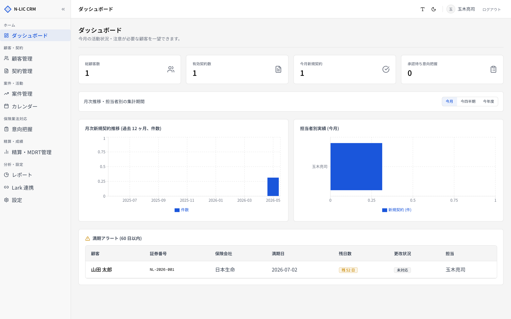
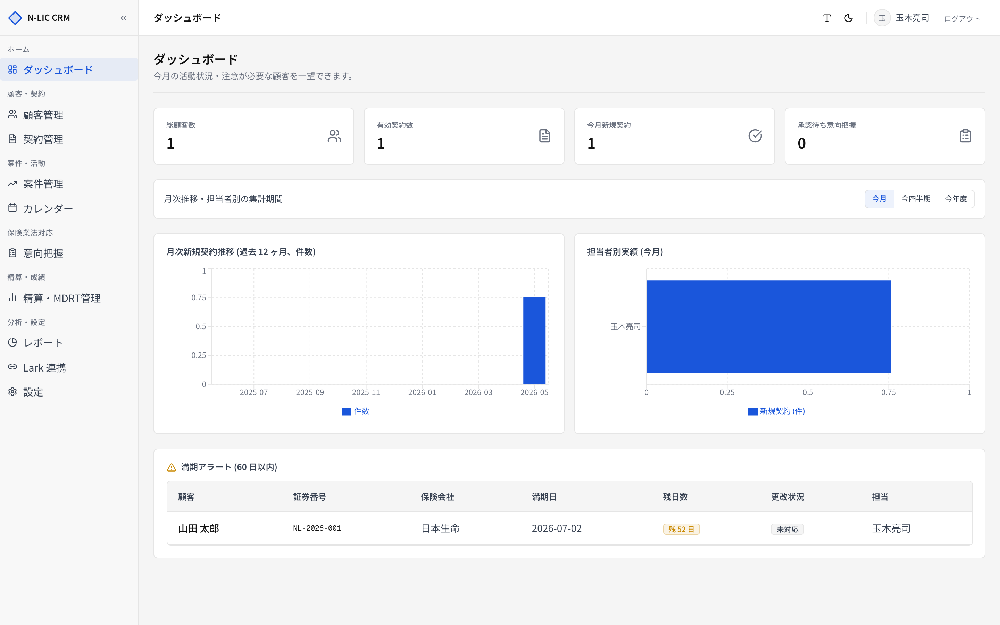

# 10. ダッシュボード

> ログイン後の最初の画面。代理店全体の **健全性 / 注意すべき契約** を一覧できます。
> サイドバー **［ダッシュボード］** から開きます。

## 画面構成

| ブロック | 内容 |
|---|---|
| ① KPI カード × 4 | 総顧客数 / 有効契約数 / 今月新規契約 / 承認待ち意向把握 |
| ② 期間フィルター | 月次推移／担当者別実績の集計期間 |
| ③ 月次新規契約推移 | 過去 12 ヶ月 |
| ④ 担当者別実績 | 期間設定に依存 |
| ⑤ 満期アラート | 60 日以内に満期の有効契約 |

## KPI カード

| カード | 集計 | リンク先 |
|---|---|---|
| 総顧客数 | 削除されていない顧客 | **［顧客管理］** |
| 有効契約数 | `status='有効'` の契約 | **［契約管理］** (`?status=有効`) |
| 今月新規契約 | 当月作成の契約 | **［契約管理］** |
| 承認待ち意向把握 | `承認待` ステータスの記録（あれば **黄色強調**） | **［意向把握］** (`?status=承認待`) |

カードをクリックすると、関連画面へフィルター付きで遷移します。

## 期間フィルター

3 つのプリセット：

| ボタン | 範囲 |
|---|---|
| 今月 | 当月の 1 日〜今日 |
| 今四半期 | 当四半期の開始〜今日 |
| 今年度 | 当年の 1 月 1 日〜今日 |

URL クエリ `?period=this_month` 等で保持。

## 月次新規契約推移

過去 12 ヶ月の **新規契約件数** を棒グラフで表示します（期間フィルターの影響なし）。
レポート画面の同名グラフと同じデータ。

## 担当者別実績

期間内の **新規契約数** を担当者ごとに集計します。
件数の多い担当者から横棒で表示。

## 満期アラート

**60 日以内** に満期を迎える `有効` 契約を一覧します。

| 列 | 内容 |
|---|---|
| 顧客 | 顧客名 |
| 証券番号 | |
| 保険会社 | |
| 満期日 | `YYYY-MM-DD` |
| 残日数 | 0 〜 60 日 (バッジ色：30 日以下で赤、60 日以下で黄) |
| 更改状況 | 未対応 / 対応中 等のバッジ |
| 担当 | 担当者氏名 |

行クリックで契約詳細へ移動。

## 業務フロー例

### 朝のチェックインルーチン

1. **ダッシュボード** を開く
2. **承認待ち意向把握** が 0 でなければ確認・承認
3. **満期アラート** を上から処理（残日数が少ない順）
4. 期間を「今月」に設定し、担当者別実績を確認

### 月次定例（管理者）

1. 期間を **今年度** に設定
2. 月次推移と担当者別実績を確認
3. 詳細分析は [09. レポート](./09_reports.md) へ

## 注意点

- ダッシュボードは **テナント単位** で表示されます。他代理店のデータは見えません（RLS で制御）。
- 担当者ロール (`agent`) でログインした場合、KPI と満期アラートは **自分の担当分のみ** を表示する仕様への拡張余地あり（現状は全件表示）。
- データは Server Components で SSR されるため、ページリロードで最新化されます。
