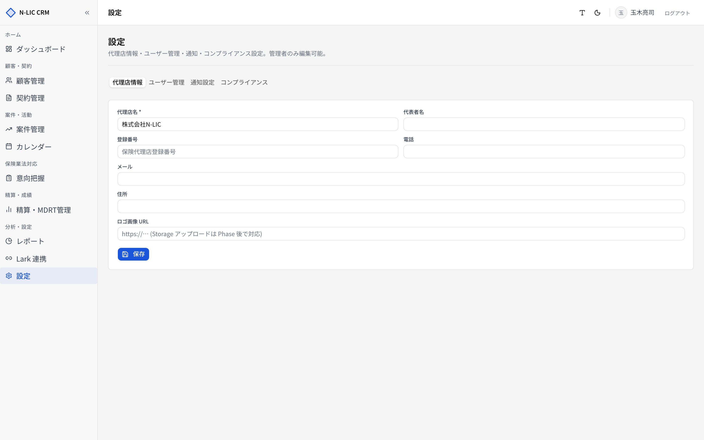
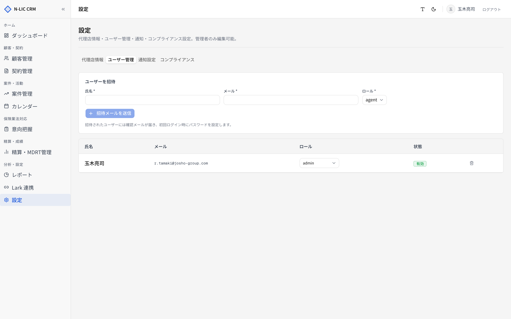
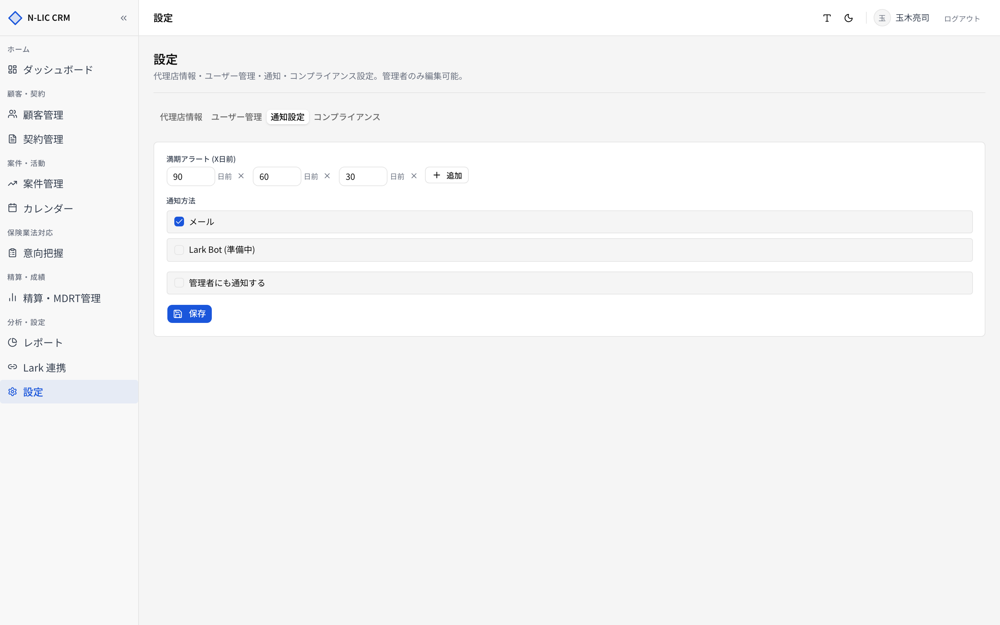
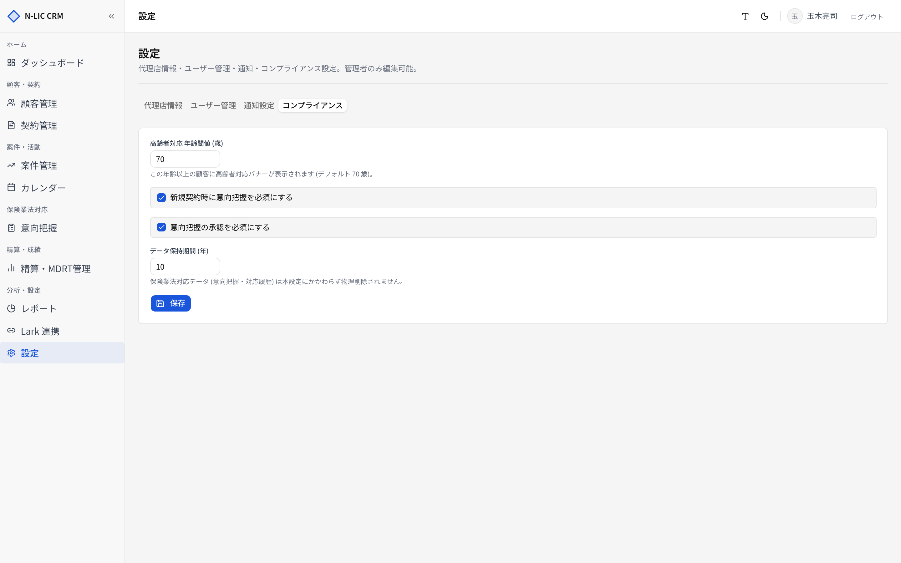

# 11. 設定

> 代理店情報、ユーザー管理、通知、コンプライアンス設定。
> サイドバー **［設定］** から開きます。
> **管理者ロール (`admin`)** のみ編集可能。それ以外のロールは閲覧のみ（フィールドはグレーアウト）。

## タブ構成

| タブ | 内容 | 操作 |
|---|---|---|
| 代理店情報 | 代理店名・代表者・住所・連絡先・登録番号 | admin のみ編集可 |
| ユーザー管理 | アカウント招待、ロール変更、有効/無効 | admin のみ操作可 |
| 通知設定 | 満期アラート日数、通知方法 | admin のみ編集可 |
| コンプライアンス | 高齢者閾値、意向把握必須化、データ保持年数 | admin のみ編集可 |

## 代理店情報

| 項目 | 必須 | 説明 |
|---|---|---|
| 代理店名 | ✓ | 100 文字以内。保存すると `tenants.name` も同期 |
| 代表者名 | | 50 文字以内 |
| 住所 | | 200 文字以内 |
| 電話番号 | | 数字／`- + ( )` のみ、30 文字以内 |
| メールアドレス | | RFC 準拠 |
| 登録番号 | | 50 文字以内（保険代理店登録番号） |
| ロゴ URL | | URL 形式（ヘッダー・印刷物で利用予定） |

## ユーザー管理

### 一覧

| 列 | 内容 |
|---|---|
| 氏名 | |
| メールアドレス | ログイン ID として利用 |
| ロール | admin / agent / staff |
| 部署 | (任意) |
| ステータス | 有効 / 無効 |

### ユーザー招待

**［ユーザーを招待］** ボタンから招待モーダルを開きます。

| 項目 | 必須 | 内容 |
|---|---|---|
| メールアドレス | ✓ | RFC 準拠 |
| 氏名 | ✓ | 50 文字以内 |
| ロール | ✓ | admin / agent / staff |

#### 招待の挙動

1. Supabase Auth に **招待メール送信**（`auth.users` に行が作成される）
2. **`user_profiles`** に同 ID で行を作成（ロール・テナント所属を設定）
3. 招待されたユーザーはメール内リンクからパスワード設定 → ログイン可能

| ロール | 主な権限 |
|---|---|
| **admin** | 設定変更・ユーザー招待・意向把握の承認・Lark 連携設定 |
| **agent** | 担当顧客・契約・案件の登録／編集／意向把握作成 |
| **staff** | 顧客・契約の検索／登録／編集。意向把握の承認は不可 |

### ロール変更

ユーザー行右側の **ロール ドロップダウン** から変更します。即時反映。

### アカウント無効化

ユーザー行右側の **［無効化］** で `is_active=false`。再有効化は **［有効化］** で。

> ⚠️ 無効化されたユーザーは：
> - ログイン不可
> - 顧客・契約の担当者選択肢から除外
> - 過去の担当履歴・対応履歴はそのまま残る

## 通知設定

### 満期アラート

満期 X 日前にアラートを通知。複数日数を設定可能。

| 項目 | 既定値 | 制限 |
|---|---|---|
| 満期アラート (X日前) | 90 / 60 / 30 | 1〜5 個、0〜365 |

### 通知方法

| 項目 | 内容 |
|---|---|
| メール | システムからメール送信（実装は順次） |
| Lark Bot | Lark チャットへ Bot 通知（[12. Lark 連携](./12_lark_integration.md) 参照、準備中） |
| 管理者にも通知 | 担当者だけでなく管理者にも CC で通知 |

## コンプライアンス

| 項目 | 既定 | 内容 |
|---|---|---|
| 高齢者の年齢閾値 | 70 | この年齢以上の顧客は **高齢者** フラグが立つ。意向把握で追加チェックが必須に |
| 新規契約に意向把握書を必須化 | ON | OFF にすると契約登録時の意向把握書 ID 確認をスキップ（コンプラ的に非推奨） |
| 意向把握書の承認を必須化 | ON | OFF にするとフォースで承認なしでも契約紐付け可（コンプラ的に非推奨） |
| データ保持年数 | 10 | 削除済みデータの保持期間。年数超過後は技術担当による物理削除可 |

> ⚠️ コンプライアンス設定の **「意向把握書を必須化」** を OFF にすると、保険業法対応の証跡が欠落する可能性があります。法令確認の上、明確な根拠なしには変更しないでください。

## 業務フロー例

### 新しいスタッフを迎え入れる

1. **［ユーザー管理］** タブ → **［ユーザーを招待］**
2. メールアドレス・氏名・ロール（staff）を入力 → 招待送信
3. スタッフがメール内リンクからパスワード設定
4. ログイン → 顧客・契約の登録作業を開始

### 高齢者基準の見直し

1. 監督官庁ガイドラインに合わせて閾値を変更（例: 70 → 65）
2. **［コンプライアンス］** → 高齢者年齢閾値を `65` に変更 → 保存
3. `customers_with_age` ビュー経由で全顧客の `is_elderly` フラグが即時更新される
4. 該当顧客の意向把握では高齢者対応チェックリストが必須に

## トラブルシュート

| 症状 | 原因 | 対応 |
|---|---|---|
| フィールドが編集できない | admin ロールでない | admin に依頼、または自分が admin か確認 |
| 招待メールが届かない | スパム判定／メールアドレス誤り | スパムフォルダ確認、メアドを再確認 |
| ロール変更が反映されない | キャッシュ／セッション | ユーザーに再ログインを依頼 |
