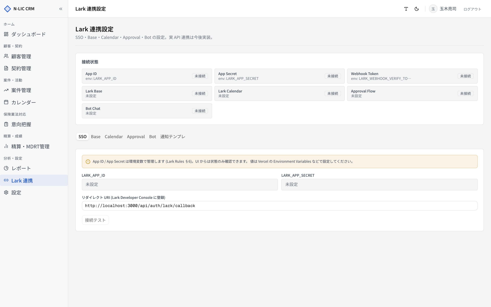
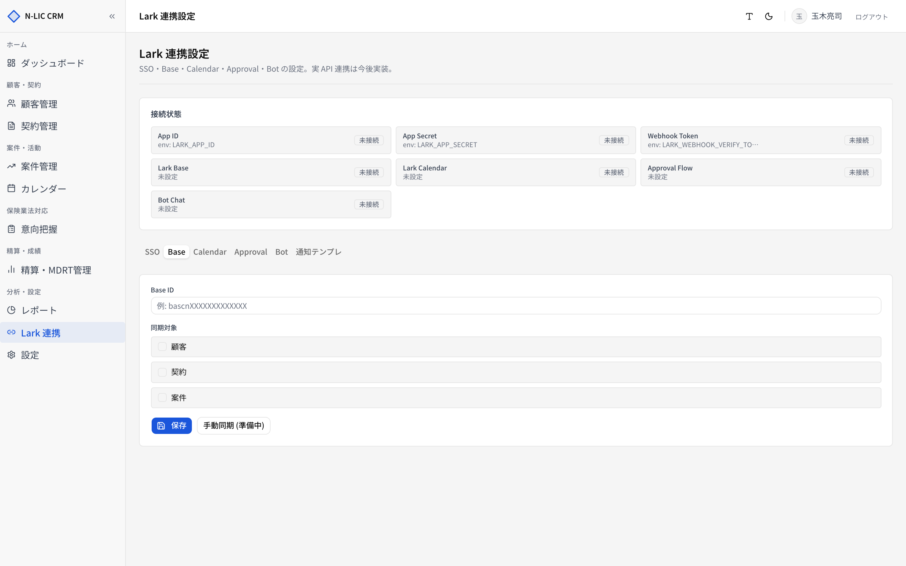
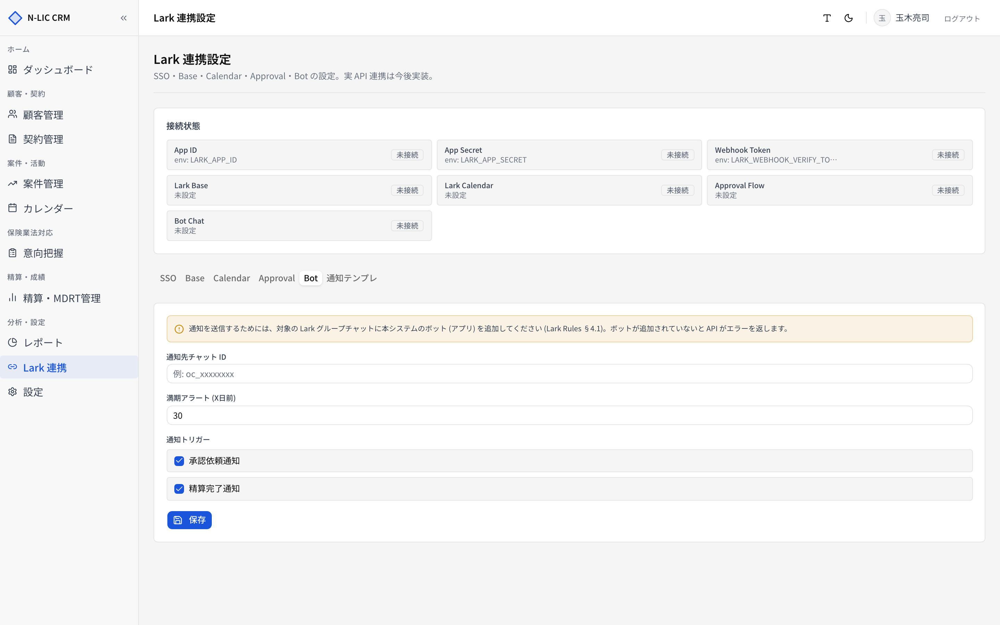
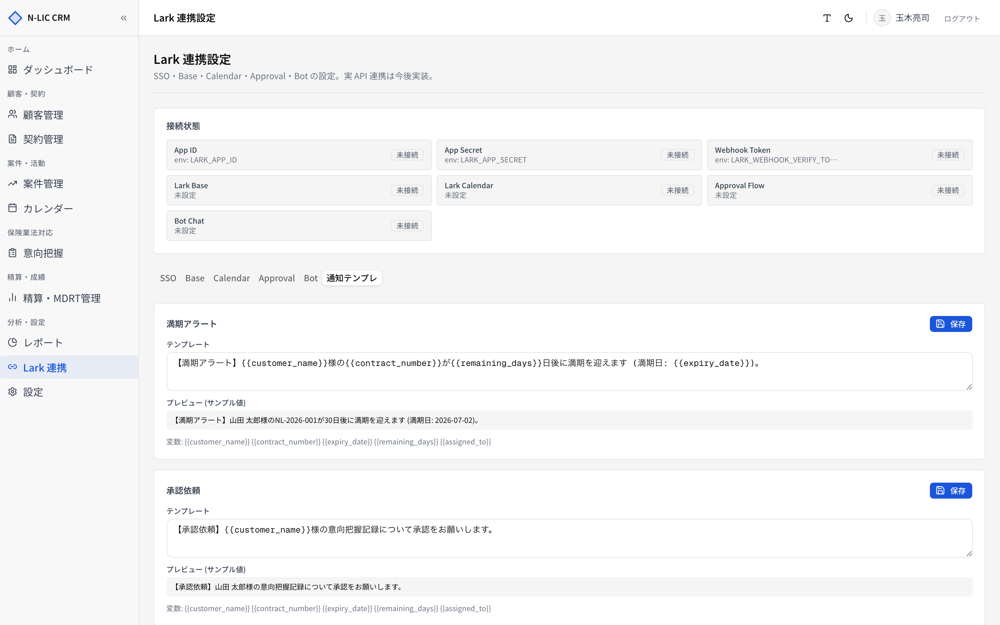

# 12. Lark 連携

> Lark（飛書）の各種サービスと HOKENA CRM を連携させる設定画面。
> サイドバー **［Lark 連携］** から開きます。

> ⚠️ 現在、**実際の Lark API 連携は段階的に実装中** です。設定 UI と DB 保存は完成していますが、同期・通知の実 API 呼び出しは順次有効化されます。

## 接続状態サマリー

ページ最上部に **接続状態カード** が並びます。

| 項目 | 設定箇所 |
|---|---|
| App ID | 環境変数 `LARK_APP_ID` |
| App Secret | 環境変数 `LARK_APP_SECRET` |
| Webhook Token | 環境変数 `LARK_WEBHOOK_VERIFY_TOKEN` |
| Lark Base | `base.base_id` |
| Lark Calendar | `calendar.calendar_id` |
| Approval Flow | `approval.intention_flow_id` |
| Bot Chat | `bot.alert_chat_id` |

「接続済」「未接続」のバッジで一目で状況がわかります。

## タブ構成

| タブ | 内容 |
|---|---|
| SSO | Lark OAuth でのシングルサインオン設定 |
| Base | Lark Base との顧客／契約／案件の双方向同期 |
| Calendar | 予定の Lark Calendar 同期 |
| Approval | 意向把握の Lark 承認フロー連携 |
| Bot | 通知 Bot のチャット設定 |
| 通知テンプレ | 各通知文面のテンプレート編集 |

## SSO（シングルサインオン）

Lark Developer Console でアプリ登録した上で、以下を設定します。

| 項目 | 設定場所 | 説明 |
|---|---|---|
| `LARK_APP_ID` | 環境変数 | Lark アプリの App ID |
| `LARK_APP_SECRET` | 環境変数 | Lark アプリの App Secret |
| リダイレクト URI | 表示のみ（コピー用） | これを Lark Developer Console に登録 |

> ⚠️ App Secret は環境変数管理（Lark Rules §6）。UI から直接編集はできません。**Vercel の Environment Variables** などで設定してください。

**［接続テスト］** で疎通確認が行えます（実 API 連携後）。

## Base

Lark Base（飛書ベース）と顧客・契約・案件を同期します。

| 項目 | 設定 |
|---|---|
| Base ID | `bascnXXXXXXXXXXX` 形式 |
| 同期対象 | 顧客 / 契約 / 案件 のチェック |

**［手動同期］** ボタンで強制同期（実 API 連携後）。

## Calendar

| 項目 | 設定 |
|---|---|
| Calendar ID | Lark カレンダー ID |
| 同期対象 | カレンダーイベント |

HOKENA CRM のカレンダー予定が、Lark Calendar に自動で双方向同期されます（[08. カレンダー](./08_calendar.md) 参照）。

## Approval（承認フロー）

| 項目 | 設定 |
|---|---|
| 意向把握用 承認フロー ID | `APPROVAL_FLOW_XXXXX` |

意向把握の承認時に Lark の承認フローを起動します（[06. 意向把握](./06_intentions.md) 参照）。

## Bot

通知 Bot のチャット設定。

| 項目 | 設定 |
|---|---|
| 通知先チャット ID | `oc_xxxxxxxx` 形式 |
| 満期アラート (X日前) | 数値 |
| 通知トリガー | 承認依頼 / 精算完了 |

> ⚠️ **重要**: 通知を送るには、対象の Lark グループチャットに **本システムのボット (アプリ) を追加** する必要があります（Lark Rules §4.1）。ボットがチャットに追加されていないと API がエラーを返します。

## 通知テンプレート

Lark Bot から送る通知文面を、テンプレートとして編集できます。

| テンプレートキー | 用途 |
|---|---|
| 満期アラート | 満期 X 日前の通知 |
| 承認依頼 | 意向把握書の承認待ち通知 |
| 精算完了 | 月次精算完了通知 |

### 使える変数

| 変数 | 例 |
|---|---|
| `{{customer_name}}` | 山田 太郎 |
| `{{contract_number}}` | NL-2026-001 |
| `{{expiry_date}}` | 2026-07-02 |
| `{{remaining_days}}` | 30 |
| `{{assigned_to}}` | 玉木亮司 |

リアルタイムプレビューでサンプル値を埋め込んだ文面を確認できます。

## 環境変数

Lark 連携で利用する環境変数一覧。

| 変数 | 用途 | 推奨設定場所 |
|---|---|---|
| `LARK_APP_ID` | App ID | Vercel Production / Preview |
| `LARK_APP_SECRET` | App Secret（秘匿） | Vercel Production / Preview, Sensitive |
| `LARK_OAUTH_REDIRECT_URI` | OAuth リダイレクト URI | Production 環境ごとに切り分け |
| `LARK_WEBHOOK_VERIFY_TOKEN` | Webhook 検証トークン | Sensitive |

## 初期セットアップ手順

1. **Lark Developer Console** でアプリ作成
2. アプリの App ID / App Secret を取得 → Vercel の Environment Variables に登録
3. リダイレクト URI を Console に登録（**［SSO］** タブで表示される URL をコピー）
4. アプリに必要な権限スコープを付与（ベース・カレンダー・チャット・承認）
5. HOKENA CRM の **［Lark 連携］** で各タブの ID を入力
6. Bot を通知先チャットに招待
7. **［接続テスト］** で疎通確認

## トラブルシュート

| 症状 | 原因 | 対応 |
|---|---|---|
| 「Lark アカウントでログイン」が押せない | App ID/Secret 未設定 | 環境変数を Vercel に登録、再デプロイ |
| 通知が届かない | チャットに Bot 未追加 | Lark 上で Bot をチャットに招待 |
| Base 同期が反映されない | Base ID 誤り／権限不足 | Console で権限スコープを再確認 |
| 承認フローが起動しない | フロー ID 誤り | Lark Approval の URL から ID を再取得 |
